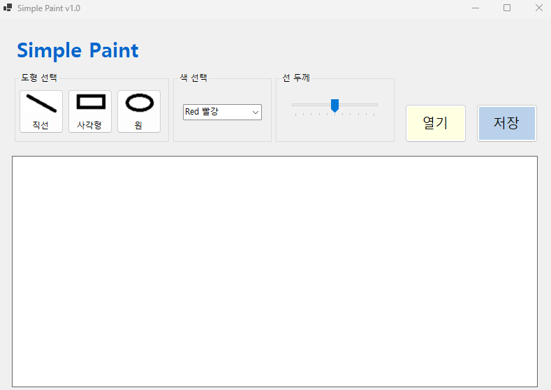
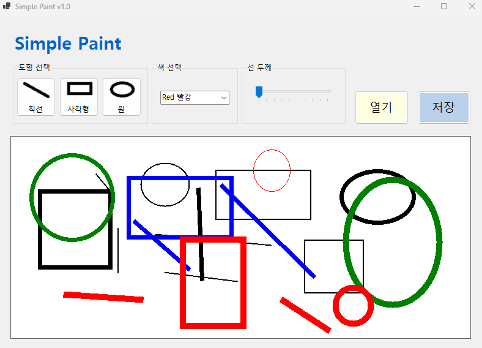
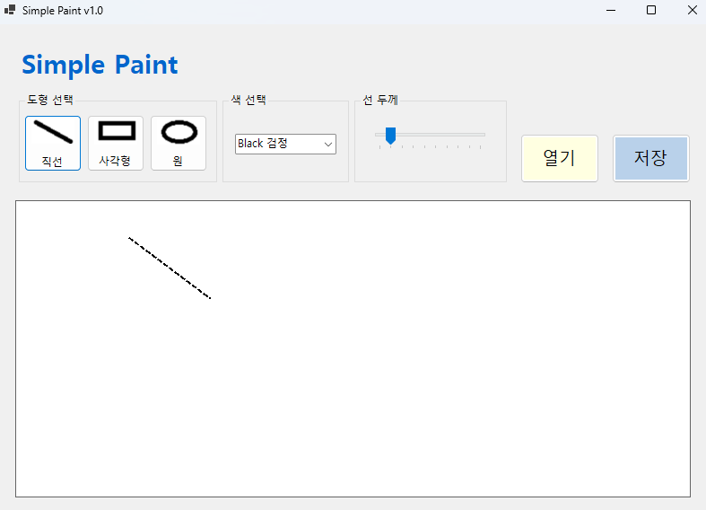

# (C# 코딩) SimplePaint

## 개요
- C# 프로그래밍 학습
- 1줄 소개: 간단한 그림판 프로그램 만들기
- 사용한 플랫폼 :
	- Label, Button, PictureBox, ComboBox, TrackBar
- 사용한 기술과 구현한 기능:
	- 

## 실행 화면 (과제1)
- 1단계 코드의 실행 스크린샷

- 구현한 내용 (위 그림 참조)
	- UI 구성 : 도형 선택, 색 선택, 선 굵기 조절, 캔버스 구성
	- 도형 선택 : 버튼 3개로 원, 사각형, 선 선택
	- 색 선택 : ComboBox로 검정, 빨강, 초록, 파랑 선택
	- 선 굵기 선택 : TrackBar로 1~10까지 조절
	- 캔버스 : PictureBox로 그림 그릴 영역 구성

## 실행 화면 (과제2)
- 2단계 코드의 실행 스크린샷

- 구현한 내용 (위 그림 참조)
	- 도형 선택 기능 구현 : 직선, 원, 사각형 그리기 기능
	- 마우스 드래그 : 마우스를 드래그할때 점선으로 그릴 도형 미리보기 표시 기능 구현
	- 색 선택 기능 구현 : ComboBox에서 선택한 색으로 도형 그리기 기능 구현
	- 선 굵기 선택 기능 구현 : TrackBar에서 선택한 값으로 도형의 선 굵기 조절 기능 구현